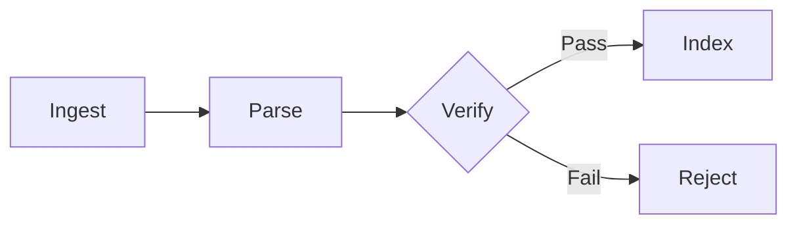

## Content types

| Type | Strategy | Sources |
|------|----------|---------|
| Legal news | Domain trust, fact-check APIs | NewsGuard, AllSides |
| Judge names | Court rosters | U.S. Courts, state courts |
| Elected officials | Gov APIs, election boards | State SOS, Ballotpedia |
| Election details | Certified filings | State boards, FEC |
| Laws | Code repositories | eCode360, legislatures |
| Court documents | PACER, CourtListener | CourtListener API |
| Templates | Form registry, checksum | Official court forms |

## Validation pipeline

Only content that passes verification is indexed. All outputs carry provenance (source, date, verification status).
