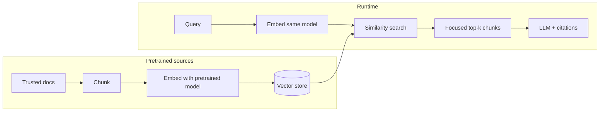

# How Embeddings Create Focused and Pretrained Sources

Short reference for Texas Tech CS5374 (Software Validation and Verification): using embeddings to narrow and stabilize the source set for RAG and agent pipelines.

---

## 1. The problem without embeddings

- **Keyword search**: Matches surface text. Misses paraphrases, synonyms, and concepts. Many irrelevant hits.
- **Unfocused sources**: Large corpora (e.g., full course PDFs, entire legal DB) get passed to the LLM, adding noise and weakening traceability.
- **No stable “source of truth”**: Each run may pull different snippets; harder to verify and reproduce.

---

## 2. How embeddings help: more focused sources

**Embeddings** map text (or chunks) to fixed-size vectors so that *semantically similar* text is close in vector space.

| Aspect | Effect |
|--------|--------|
| **Semantic retrieval** | Query and corpus are embedded; retrieval returns chunks *similar in meaning*, not just keyword overlap. |
| **Narrower context** | You retrieve top-*k* nearest neighbors instead of every document that contains a word. Fewer, more relevant chunks. |
| **Chunk-level granularity** | Sources are paragraphs or sections (chunks), not whole documents. The model sees only what’s needed. |
| **Traceability** | Each answer can cite specific chunk IDs and spans. You can verify “this claim came from this chunk.” |

So: **focused sources** = fewer, semantically relevant chunks, with clear provenance for V&V.

```
┌─────────────────┐     embed      ┌─────────────────┐     similarity    ┌─────────────────┐
│  User query     │ ──────────────►│  Query vector   │ ─────────────────►│  Top-k chunks   │
│  "liability for │                │                 │    (e.g. cosine)   │  (focused set)  │
│   negligence"   │                │                 │                   │                 │
└─────────────────┘                └─────────────────┘                   └────────┬────────┘
                                                                                    │
       Raw corpus ──► chunk ──► embed ──► store in vector DB ◄──────────────────────┘
                    (paragraphs)         (pretrained index)
```

---

## 3. How embeddings help: pretrained sources

**“Pretrained”** here means two things that both stabilize and focus sources:

### 3.1 Pretrained embedding model

- A model (e.g., OpenAI `text-embedding-3-small`, Cohere, open-source sentence transformers) is **already trained** on large text.
- You don’t train it on your corpus. You **use** it to turn your chunks and queries into vectors.
- Same model + same text ⇒ same vector ⇒ **reproducible** retrieval. Important for verification and regression.

### 3.2 Pre-indexed corpus (vector store built once)

- You **chunk** your trusted documents (specs, legal DB, course notes) once.
- You **embed** all chunks with the pretrained model and **store** them in a vector DB (e.g., FAISS, Chroma, LangChain vector stores).
- At runtime you only **query** this index. You do not re-embed the whole corpus on every request.

So: **pretrained sources** = fixed embedding model + pre-built index over a fixed corpus. The “source of truth” is defined and versioned; retrieval is deterministic for the same query and index.

```
                    PRE-BUILD (offline, once)
                    ─────────────────────────
  Trusted docs ──► Chunk ──► Embed (pretrained model) ──► Vector store
       (PDFs, DB)   (e.g. 512 tokens)                      (FAISS, Chroma, etc.)
                                                                  │
                    RUNTIME (per query)                            │
                    ───────────────────                            │
  User query ──► Embed (same model) ──► Similarity search ─────────┘
                                         │
                                         ▼
                              Focused, pretrained sources
                              (same corpus, same model, reproducible)
```

---

## 4. Pipeline summary (Mermaid)



- **Left (Pretrained)**: One-time build of the source index from a fixed corpus and a fixed embedding model.
- **Right (Runtime)**: Each query is embedded with the same model; similarity search returns a **focused** set of chunks from that **pretrained** index.

---

## 5. V&V relevance

| V&V concern | How embeddings help |
|-------------|----------------------|
| **Traceability** | Each retrieved chunk has an ID and span. You can require “every claim must cite a chunk” and verify in LangSmith or logs. |
| **Reproducibility** | Same embedding model + same vector store + same query ⇒ same top-k. Enables regression tests and reproducible evaluations. |
| **Validation (right thing)** | Corpus and chunking define the “allowed” source set. Embeddings don’t add new content; they filter that set by relevance. |
| **Verification (built right)** | You can run evaluations (e.g., LangSmith) on “answer grounded in retrieved chunks” and check that retrieved chunks match the gold source set. |

---

## 6. One-sentence takeaway

**Embeddings give you focused sources (semantic top-k instead of keyword soup) and pretrained sources (fixed model + pre-indexed corpus), so the pipeline uses a well-defined, reproducible, and verifiable set of evidence.**
